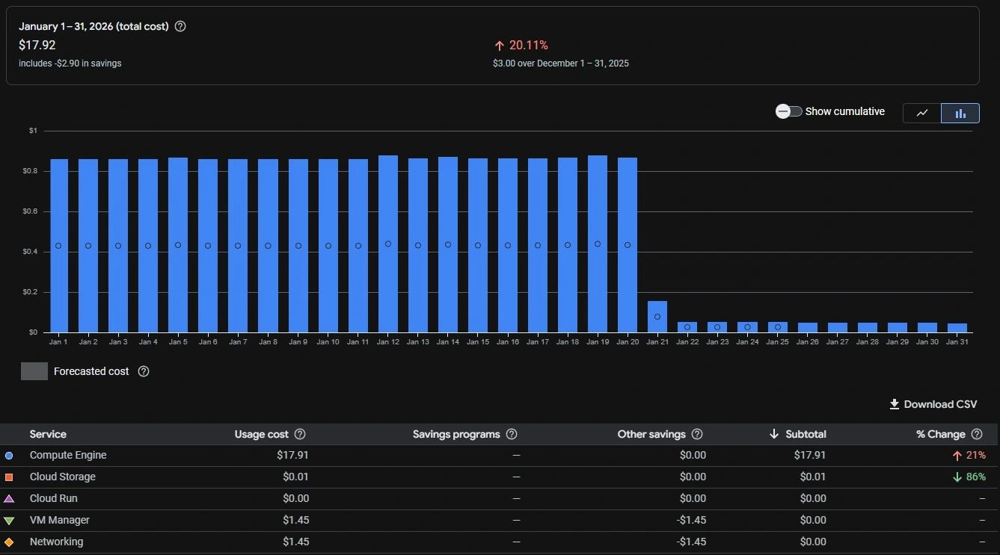
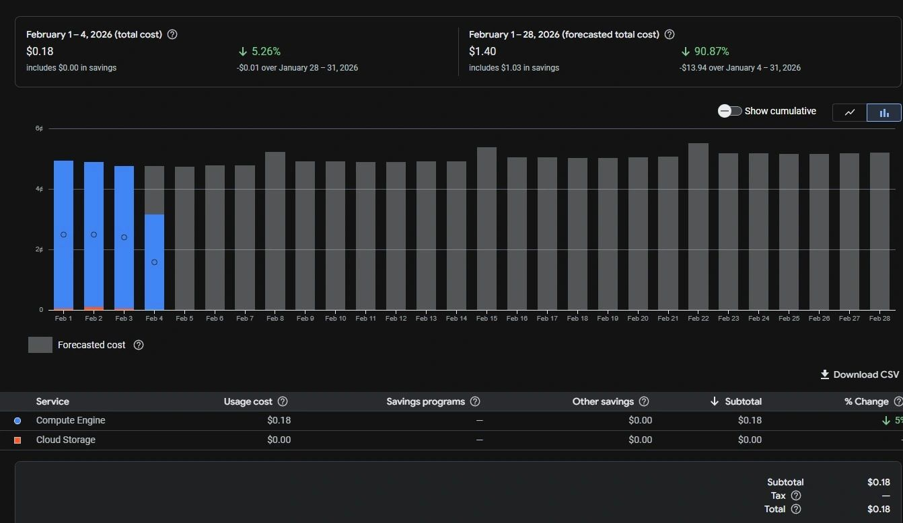
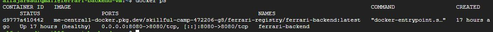
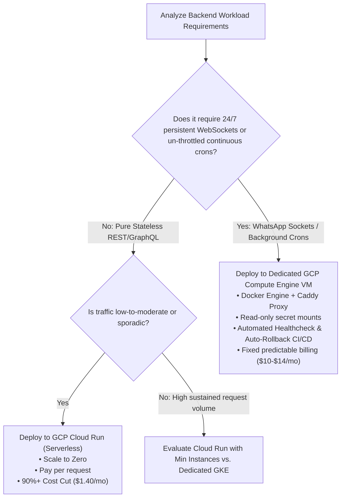

# 🚀 GCP Cloud Cost Optimization: From VM to Serverless & Right-Sized Infrastructure

> **Comprehensive Engineering Case Study & Architecture Reference**  
> *Optimizing Google Cloud Platform (GCP) infrastructure for low-traffic microservices (90% cost reduction) and high-value persistent enterprise backends (>50% cost reduction with 100% SLA).*

[](https://cloud.google.com/)
[](https://www.docker.com/)
[](https://nodejs.org/)
[](https://www.typescriptlang.org/)
[](https://caddyserver.com/)
[](https://github.com/features/actions)

---

## 📌 Executive Summary

This repository documents the complete cloud infrastructure optimization analysis conducted by **Anandhu V S** (Web Developer & Cloud Engineer). 

Modern cloud deployment requires aligning workload runtime characteristics with the appropriate compute model. A "one-size-fits-all" approach to infrastructure leads to either massive cost inefficiency or operational instability.

This project covers a dual-phase architectural evolution across real-world production Node.js & TypeScript backends running on Google Cloud Platform:

1. **Phase 1: Unoptimized Always-On VM ➔ Serverless Cloud Run**  
   - **Target**: Low-to-moderate traffic stateless APIs.
   - **Result**: **90.87% monthly cost reduction** (dropped from **$17.92/mo** to **~$1.40/mo**).
2. **Phase 2: Persistent Serverless ➔ Right-Sized Dedicated VM + Caddy Proxy + Auto-Rollback CI/CD**  
   - **Target**: High-value financial & operational backend processing 50-60+ daily enterprise entries requiring persistent 24/7 WebSockets (`@whiskeysockets/baileys`) and scheduled daily compliance cron jobs (`node-cron`).
   - **Result**: **>50% monthly cost cut** over unoptimized serverless connection holding, **100% WebSocket connection stability**, **sub-second alert delivery**, and **0 production downtime** via automated container healthcheck evaluation.

---

## 🖼️ Verified Financial & Operational Evidence

### 1. Stateless Cloud Run Migration (90.87% Cost Cut)
| Baseline VM Monthly Cost (Jan 2026) | Cloud Run Monthly Forecast (Feb 2026) |
| :---: | :---: |
|  |  |

---

### 2. Dedicated VM Production Deployment & Zero Downtime Auto-Rollback
| Production Container Health (`docker ps`) | Healthcheck Evaluation & Backup Purge Log |
| :---: | :---: |
|  |  |

---

## 📊 Core Architectural Decision Matrix

| Dimension | Phase 1: Cloud Run Serverless | Phase 2: Dedicated VM + Caddy + Docker | Unoptimized VM (Baseline) |
| :--- | :--- | :--- | :--- |
| **Best Workload Fit** | Low/moderate traffic, stateless REST/GraphQL APIs | Persistent WebSockets, scheduled crons, steady state | Unmanaged monolithic state |
| **Scaling Model** | Scale-to-zero (0 to 20 instances auto) | Fixed baseline (`e2-medium`, 2 vCPU, 4GB RAM) | Fixed static compute |
| **Billing Model** | Pay per request / active execution time | Predictable fixed monthly cost | Pay 24/7 for idle compute |
| **Monthly Cost** | **~$1.40 / month** (forecasted) | **~$10.49 - $14.96 / month** | **~$17.92 - $22.52 / month** |
| **WebSocket Support** | Drops on idle scale-to-zero (`DisconnectReason 409`) | **100% Uptime** (persistent event loop) | Supported but unoptimized |
| **Cron Execution** | Subject to CPU throttling during idle windows | **Continuous clock** (fires precisely at 08:00 AM) | Supported |
| **Reverse Proxy / SSL** | Managed by Cloud Run | Caddy Server (Auto Let's Encrypt TLS on Port 443) | Manual certbot / Nginx |
| **Deploy Safety** | Managed revision routing | Automated 35s Healthcheck + **Auto-Rollback** | Manual restart risk |

---

## 🛠️ Repository Architecture & Documentation Quick Links

To explore the detailed implementations, schemas, workflows, and evidence, navigate through the following documentation modules:

```
.
├── README.md                           # Main repository overview & decision framework
├── assets/                             # Visual proof image assets & screenshots
└── docs/
    ├── ARCHITECTURE.md                 # Technical system diagrams & component breakdown
    ├── DEPLOYMENT_AND_CICD.md          # Step-by-step implementation guide & auto-rollback scripts
    ├── CASE_STUDY.md                   # Full 3-post unified case study & financial ROI analysis
    └── PROOFS_AND_METRICS.md           # Visual evidence index mapping GCP Billing & Console proofs
```

- 📖 **[System Architecture & Diagrams](docs/ARCHITECTURE.md)**: Deep dive into the stateless Cloud Run setup vs. the dedicated Compute Engine + Caddy + Docker setup.
- ⚙️ **[Deployment & CI/CD Guide](docs/DEPLOYMENT_AND_CICD.md)**: Complete production `Dockerfile`, `Caddyfile`, GitHub Actions workflow, and 35s evaluation auto-rollback shell script.
- 🧾 **[Detailed Case Study](docs/CASE_STUDY.md)**: Comprehensive narrative uniting all problem findings, engineering trade-offs, and billing proofs.
- 🖼️ **[Proofs & Metrics Index](docs/PROOFS_AND_METRICS.md)**: Breakdown of GCP Billing charts, Cloud Run metrics, Docker container states, and deployment logs.

---

## 🧠 Architectural Decision Framework: When to Use What?



---

## 📈 Key Accomplishments & Metrics

- 📉 **90.87% Cost Cut** on low-traffic stateless Node.js/TypeScript backend services via Cloud Run.
- 📉 **>50% Cost Cut** on persistent enterprise backend workloads relative to unoptimized serverless execution.
- ⚡ **100% Uptime** on persistent WebSocket connections for WhatsApp alert dispatch (`@whiskeysockets/baileys`).
- ⏰ **Zero Missed Cron Jobs** for daily 08:00 AM compliance processing via uninterrupted system clocks.
- 🛡️ **Zero Downtime Deployments** backed by Docker `HEALTHCHECK` evaluation and automatic container rollback safety nets.

---

## 👤 Author & Maintainer

**Anandhu V S**  
*Web Developer & Cloud Engineer*  
- **Portfolio**: [https://lnkd.in/g4b95Qja](https://lnkd.in/g4b95Qja)  
- **GitHub**: [@Anandhu362](https://github.com/Anandhu362)  
- **Focus Areas**: Cloud-native backend systems, cost-efficient cloud architectures, real-world production optimization.
