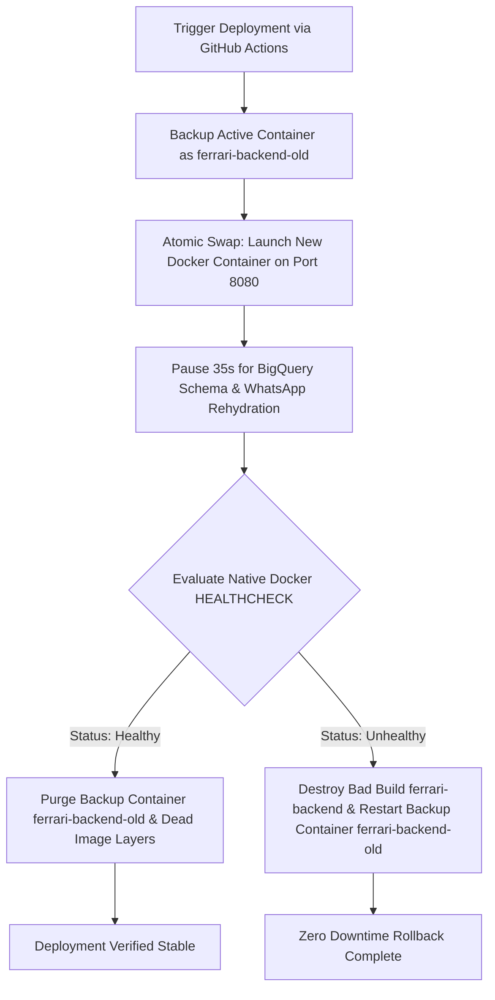

# Migrating a Production Backend from Serverless to a Dedicated GCP VM: Cut Cloud Costs by >50% 🚀

## Executive Summary
Architectural redesign and migration of a production infrastructure powering a live financial & operational system processing 50–60+ daily high-value entries across 2+ enterprise branches. Moving from GCP Cloud Run to a dedicated Compute Engine VM reduced monthly cloud infrastructure costs by **>50%**, restored **100% WebSocket stability**, and eliminated cron job freezes while guaranteeing zero-downtime deployments via an automated CI/CD rollback pipeline.

---

## 1. Problem Statement: Limitations of Serverless for Persistent Workloads

While serverless environments like GCP Cloud Run offer auto-scaling advantages for stateless microservices, persistent and real-time backend operations face fundamental operational challenges:

1. 💸 **Billing Spikes & Unpredictable Costs**:
   - Cloud Run CPU & RAM scaling during sustained traffic spikes and background processing led to volatile, high monthly bills.
2. 🔌 **WebSocket Disconnections (WhatsApp Alerts)**:
   - 24/7 WebSockets maintained via `@whiskeysockets/baileys` for automated WhatsApp alerts frequently disconnected whenever Cloud Run scaled instances down or to zero, throwing `DisconnectReason 409`.
3. ⏰ **Frozen Background Cron Jobs**:
   - Daily compliance checks scheduled via `node-cron` (e.g., executing at 08:00 AM) failed or froze because CPU throttling during idle windows suspended event-loop ticks.

---

## 2. The Solution: Dedicated GCP Compute Engine + Caddy Reverse Proxy

The architecture was migrated to a dedicated Compute Engine VM instance in `me-central1-a`:

- ⚙️ **24/7 Persistent WebSockets**: Sub-second WhatsApp message dispatch with zero connection drops.
- ⚙️ **Reliable Cron Execution**: Continuous system clock guarantees time-sensitive compliance tasks fire exactly on schedule (08:00 AM).
- ⚙️ **Caddy Reverse Proxy & Automatic SSL**: Caddy manages Port 443 HTTPS termination for the API endpoints with Let's Encrypt certificates, completely solving Vercel React frontend Mixed Content SSL constraints.
- ⚙️ **Isolated Production Secrets**: High-security production credentials (`.env`, Firebase Admin SDK, BigQuery Service Account keys) are mounted read-only (`:ro`) into isolated Docker containers.

---

## 3. Architecture & Technical Stack

| Domain | Technology / Component | Details |
| :--- | :--- | :--- |
| **Cloud Compute** | GCP Compute Engine | Ubuntu 22.04 LTS (`e2-medium`, 30GB `pd-balanced` disk, `me-central1-a`) |
| **Runtime & Proxy** | Docker Engine + Caddy Server | Reverse proxy with automatic Let's Encrypt TLS termination |
| **Data Warehouse & DB** | Google BigQuery + Firebase | Firestore & Realtime DB for state; BigQuery for analytical reporting |
| **CI/CD & Registry** | GitHub Actions + Artifact Registry | Automated build, push to GAR (`me-central1-docker.pkg.dev`), and deployment |

---

## 4. Production Safety: Zero-Downtime Auto-Rollback Pipeline

To ensure 100% service uptime during deployments, an automated zero-downtime rollback workflow was built into the deployment process:

### Deployment & Rollback Workflow



### Automated Rollback Shell Logic

```bash
# Evaluate target container health status after stabilization period
STATUS=$(docker inspect --format='{{json .State.Health.Status}}' ferrari-backend | tr -d '"')

if [ "$STATUS" = "healthy" ]; then
    echo "✅ New backend deployment verified stable. Dropping cold storage backup..."
    docker rm -f ferrari-backend-old
else
    echo "❌ Healthcheck failed! Triggering automatic rollback..."
    docker rm -f ferrari-backend
    docker start ferrari-backend-old
fi
```

---

## 5. Measurable Key Results

- 📉 **>50% Reduction** in monthly GCP cloud infrastructure expenditure.
- ⚡ **100% Uptime** on persistent WebSocket connections with sub-second dispatch latency.
- 🛡️ **Zero Downtime Deployments** backed by automated container healthcheck evaluation and instant rollback safety nets.

---

## Key Engineering Takeaway
Aligning cloud infrastructure choice with the actual runtime requirements of your backend application (such as persistent WebSockets, continuous cron clocks, and static memory footprints) delivers significantly lower cloud bills alongside superior system reliability.
