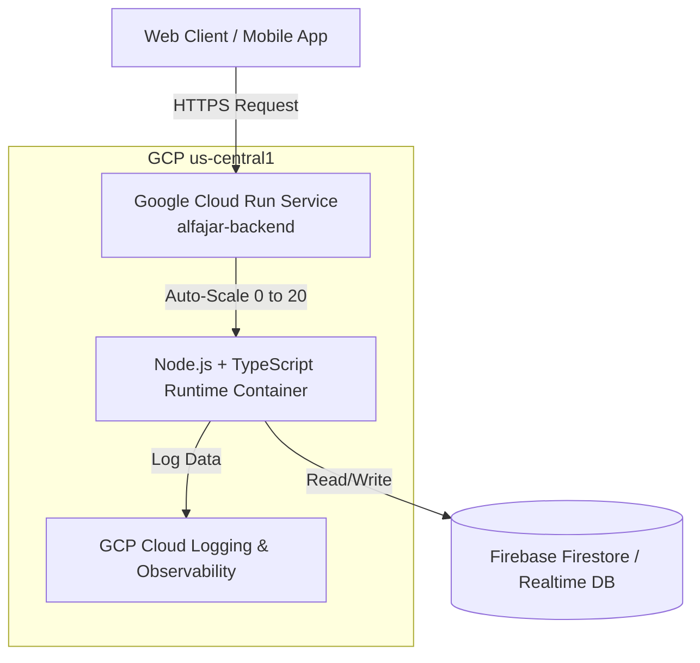
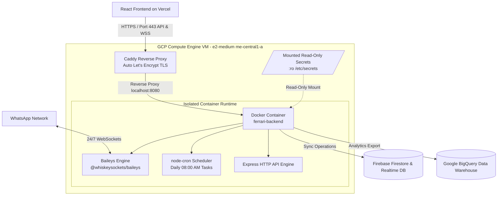

# 📐 System Architecture & Infrastructure Design

This document details the technical architecture of both GCP deployment models engineered during the cloud cost optimization process.

---

## 1. Phase 1 Architecture: Stateless Cloud Run (Serverless)

For low-to-moderate traffic, stateless microservices (such as `alfajar-backend`), the infrastructure was migrated from an unmanaged, always-running VM to **Google Cloud Run**.

### System Context Diagram



### Key Technical Characteristics
- **Scale-to-Zero**: When no incoming HTTP requests arrive, instance count drops to `0`. CPU billing halts completely.
- **On-Demand Warmup**: Incoming requests trigger instance initialization (cold start ~1-2s), after which requests execute with sub-second latencies.
- **Managed Ingress & TLS**: GCP automatically provides domain mapping, Google-managed SSL certificates, and DDoS protection on Port 443.

---

## 2. Phase 2 Architecture: Dedicated Compute Engine VM + Caddy Reverse Proxy + Docker

For persistent enterprise workloads (`ferrari-backend` processing 50-60+ daily high-value entries across 2+ branches), serverless scale-to-zero is unsuited due to WebSocket teardowns and cron throttling. The solution utilizes a dedicated, right-sized GCP Compute Engine instance (`e2-medium`) running Docker Engine and Caddy Web Server.

### Component Architecture Diagram



---

## 3. Deep Dive: Component Responsibilities

### A. Reverse Proxy & Auto-SSL (Caddy Web Server)
- **Role**: Terminates HTTPS/TLS on Port 443 and proxies clean HTTP/WebSocket traffic to internal Docker container port `8080`.
- **CORS & Mixed Content Solution**: Serves auto-renewing Let's Encrypt SSL certificates. This guarantees that frontends hosted on Vercel (`https://...`) can interact with the backend API (`https://api.yourdomain.com`) without triggering browser **Mixed Content** or **CORS** security violations.
- **WebSocket Upgrade Handling**: Caddy natively supports HTTP/1.1 to HTTP/2 and WebSocket (`Upgrade: websocket`) protocol switches with zero additional configuration overhead.

### B. Isolated Secrets Engine
- Sensitivity sensitive keys (`.env`, Firebase Admin SDK JSON, BigQuery Service Account keys) are stored securely on the VM filesystem (`/etc/secrets/`) and mounted into Docker containers using read-only volume bindings:
  ```yaml
  volumes:
    - /etc/secrets/firebase-admin.json:/app/secrets/firebase-admin.json:ro
    - /etc/secrets/bigquery-sa.json:/app/secrets/bigquery-sa.json:ro
  ```
- Prevent container vulnerability exploits from compromising static credentials or writing modified key files.

### C. Persistent Real-Time Sockets (`@whiskeysockets/baileys`)
- WhatsApp automation relies on a persistent state machine holding an active TCP/WebSocket connection to WhatsApp servers.
- Moving to a dedicated VM ensures that the connection remains continuously rehydrated without being killed by scale-to-zero algorithms or idle timeout policies.

### D. Scheduled Cron Engine (`node-cron`)
- Executes daily compliance checks at 08:00 AM sharp.
- The Compute Engine uninterrupted system clock ensures Node.js event loop ticks execute timely without sleeping or throttling.
