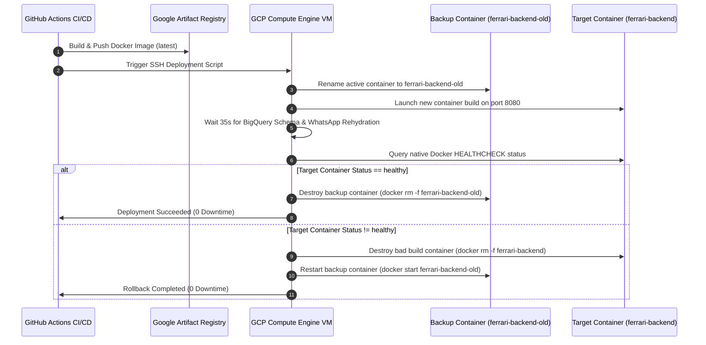

# ⚙️ Deployment & CI/CD Auto-Rollback Pipeline

This document provides step-by-step implementation instructions for setting up the production environment and configuring the zero-downtime automated deployment & rollback pipeline.

---

## 1. Production Server Setup (GCP Compute Engine)

### Instance Provisioning Specs
- **Cloud Provider**: Google Cloud Platform (GCP)
- **Service**: Compute Engine VM Instance
- **Name**: `ferrari-backend-vm`
- **Region / Zone**: `me-central1-a`
- **Machine Type**: `e2-medium` (2 vCPUs, 4GB RAM)
- **OS Image**: Ubuntu 22.04 LTS
- **Boot Disk**: 30GB `pd-balanced` SSD-backed disk

### Step 1: Install Docker Engine & Caddy
```bash
# Update system & install prerequisites
sudo apt-get update && sudo apt-get install -y curl apt-transport-https ca-certificates gnupg lsb-release

# Install Docker Engine
curl -fsSL https://get.docker.com -o get-docker.sh
sudo sh get-docker.sh
sudo usermod -aG docker $USER

# Install Caddy Web Server
sudo apt-get install -y debian-keyring debian-archive-keyring apt-transport-https
curl -1sLf 'https://dl.cloudsmith.io/public/caddy/stable/gpg.key' | sudo gpg --dearmor -o /usr/share/keyrings/caddy-stable-archive-keyring.gpg
curl -1sLf 'https://dl.cloudsmith.io/public/caddy/stable/debian.deb.txt' | sudo tee /etc/apt/sources.list.d/caddy-stable.list
sudo apt-get update
sudo apt-get install caddy
```

---

## 2. Infrastructure Configuration Files

### A. Production `Dockerfile` with Native Healthcheck
```dockerfile
FROM node:20-alpine AS builder
WORKDIR /app
COPY package*.json ./
RUN npm ci
COPY . .
RUN npm run build

FROM node:20-alpine AS runner
WORKDIR /app
ENV NODE_ENV=production
COPY package*.json ./
RUN npm ci --only=production
COPY --from=builder /app/dist ./dist

# Native Docker Healthcheck to verify system stabilization
HEALTHCHECK --interval=10s --timeout=5s --retries=3 --start-period=30s \
  CMD curl -f http://localhost:8080/api/health || exit 1

EXPOSE 8080
CMD ["node", "dist/index.js"]
```

### B. Production `Caddyfile`
```caddy
api.yourdomain.com {
    # Reverse proxy HTTPS port 443 requests to local Docker container on 8080
    reverse_proxy 127.0.0.1:8080 {
        header_up Host {host}
        header_up X-Real-IP {remote_host}
    }

    # Auto-renewing SSL certificate handled via Let's Encrypt
    tls user@yourdomain.com
}
```

---

## 3. Zero-Downtime Auto-Rollback CI/CD Pipeline

The deployment pipeline is orchestrated via **GitHub Actions** and **Google Artifact Registry (GAR)**.

### Pipeline Workflow Sequence



---

## 4. Production Rollback Shell Script (`deploy.sh`)

This script runs autonomously on the target VM during pushes from GitHub Actions:

```bash
#!/bin/bash
set -e

REGISTRY="me-central1-docker.pkg.dev/skillful-camp-472206-g8/ferrari-registry"
IMAGE_NAME="ferrari-backend:latest"
FULL_IMAGE="$REGISTRY/$IMAGE_NAME"

echo "🚀 Starting Production Zero-Downtime Deployment..."

# 1. Pull latest image from Google Artifact Registry
docker pull $FULL_IMAGE

# 2. Stage backup container if currently running
if [ $(docker ps -q -f name=ferrari-backend) ]; then
    echo "📦 Staging current container backup as 'ferrari-backend-old'..."
    docker stop ferrari-backend || true
    docker rename ferrari-backend ferrari-backend-old || true
fi

# 3. Launch new container on Port 8080 with read-only mounted secrets
echo "⚡ Launching new container revision..."
docker run -d \
  --name ferrari-backend \
  --restart unless-stopped \
  -p 8080:8080 \
  -v /etc/secrets/.env:/app/.env:ro \
  -v /etc/secrets/firebase-admin.json:/app/secrets/firebase-admin.json:ro \
  -v /etc/secrets/bigquery-sa.json:/app/secrets/bigquery-sa.json:ro \
  $FULL_IMAGE

# 4. Evaluation Window: Pause 35 seconds for BigQuery schema & WhatsApp rehydration
echo "⏳ Waiting 35 seconds for system stabilization and WhatsApp rehydration..."
sleep 35

# 5. Evaluate target container status
STATUS=$(docker inspect --format='{{json .State.Health.Status}}' ferrari-backend 2>/dev/null | tr -d '"' || echo "unhealthy")

echo "🔍 Target container status reported as: $STATUS"

# 6. Atomic Health Verification & Zero-Downtime Rollback
if [ "$STATUS" = "healthy" ]; then
    echo "✅ New deployment verified stable. Dropping cold storage backup..."
    if [ $(docker ps -a -q -f name=ferrari-backend-old) ]; then
        docker rm -f ferrari-backend-old
    fi
    docker image prune -f
    echo "🎉 Deployment successfully completed!"
else
    echo "❌ Healthcheck failed! Triggering automatic rollback..."
    docker rm -f ferrari-backend || true
    if [ $(docker ps -a -q -f name=ferrari-backend-old) ]; then
        docker start ferrari-backend-old
        docker rename ferrari-backend-old ferrari-backend
        echo "🛡️ Zero-downtime rollback completed! Previous version restored."
    fi
    exit 1
fi
```
