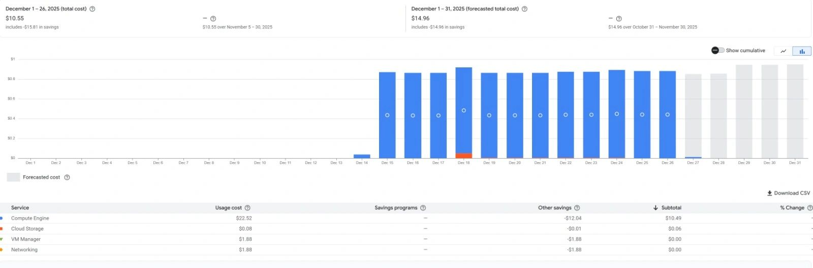
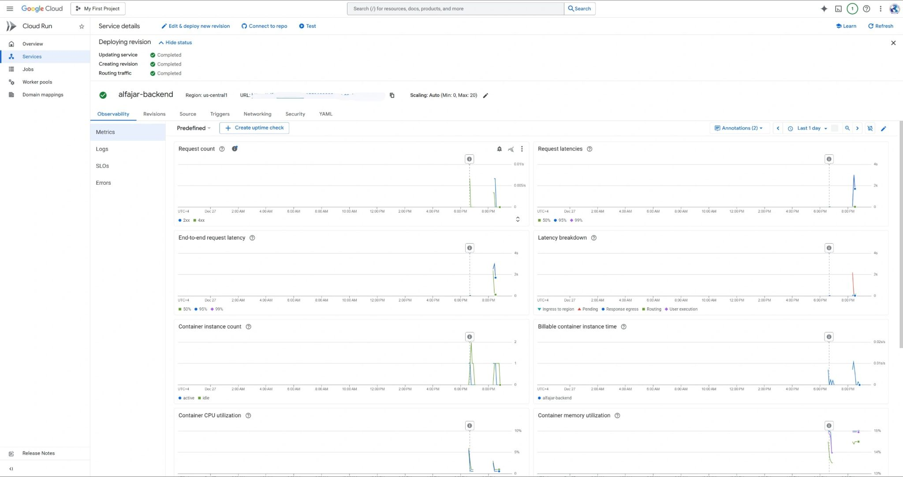
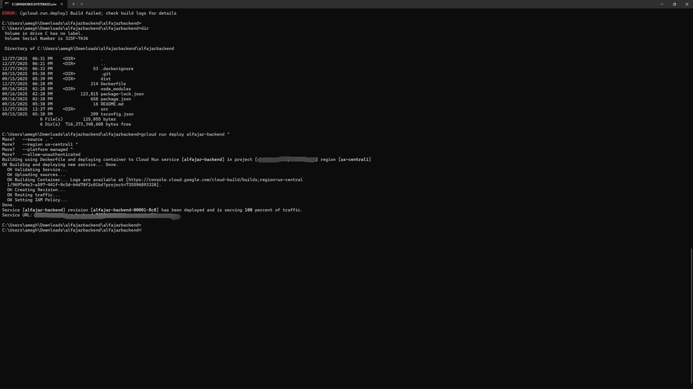
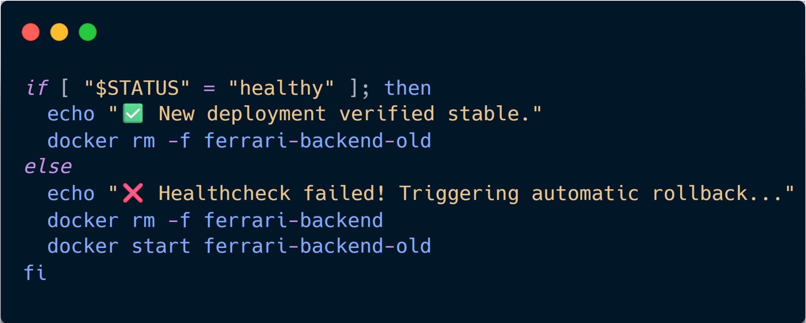

# 🖼️ Proofs, Visual Evidence & Metrics Index

This document maps all real-world visual evidence, GCP Console screenshots, billing reports, and terminal execution logs supporting the Cloud Cost Optimization analysis.

---

## 1. Visual Evidence Overview

| Figure | Subject / Metric | Component | Verification Detail | Image Link |
| :---: | :--- | :--- | :--- | :---: |
| **Fig 1** | GCP Billing December 2025 | Baseline VM Cost | Billed **$10.55** (partial) / **$14.96** forecast | [View](../assets/december_bill.jpg) |
| **Fig 2** | GCP Cloud Run Service Observability | `alfajar-backend` | Scale-to-zero active instances, low latency | [View](../assets/gcp_cloud_run_observability.jpg) |
| **Fig 3** | GCP Billing February 2026 | Cloud Run Savings | **$1.40** forecasted (**-90.87% cost reduction**) | [View](../assets/february_bill.jpg) |
| **Fig 4** | GCP Billing January 2026 | Baseline Unoptimized VM | Billed **$17.92** total monthly cost | [View](../assets/january_baseline_bill.jpg) |
| **Fig 5** | Cloud Run CLI Deployment Log | `gcloud` CLI | Successful deployment to `us-central1` | [View](../assets/cloud_run_cli.jpg) |
| **Fig 6** | Production VM Docker Status | `ferrari-backend` VM | Running `Up 17 hours (healthy)` on port 8080 | [View](../assets/docker_ps.jpg) |
| **Fig 7** | CI/CD Stabilization & Healthcheck Log | GitHub Actions / Script | 35s evaluation pass & backup container purge | [View](../assets/zero_downtime_healthcheck.jpg) |
| **Fig 8** | Auto-Rollback Script Implementation | Shell Logic | Healthcheck `healthy` vs `unhealthy` condition | [View](../assets/rollback_script.jpg) |

---

## 2. Detailed Evidence Breakdown

### Figure 1: Baseline GCP Billing (December 2025)
- **Description**: Initial billing metric showing Compute Engine costs running unoptimized VM instances ($22.52 usage cost, $10.49 subtotal after savings).
- **Key Observation**: Compute Engine accounted for over 95% of total cloud expenditure.



---

### Figure 2: Cloud Run Service Observability (`alfajar-backend`)
- **Description**: Cloud Run console metrics dashboard in `us-central1`.
- **Metrics Displayed**:
  - **Container Instance Count**: Scales dynamically from `0` to `1` on incoming requests and immediately back to `0`.
  - **Billable Container Instance Time**: Drops to zero during idle periods.
  - **Request Latency**: Sub-second execution latency breakdown.



---

### Figure 3: Cloud Run Optimization Billing Proof (February 2026)
- **Description**: GCP Billing report demonstrating the full month impact of migrating `alfajar-backend` to Cloud Run.
- **Metrics**:
  - **Feb 1–4 Total Cost**: $0.18
  - **Feb 1–28 Forecasted Cost**: **$1.40**
  - **Savings Reported**: **-90.87% change** (-$13.94 reduction compared to Jan 4–31).


---

### Figure 4: Baseline VM Cost Report (January 2026)
- **Description**: Total monthly GCP billing for unoptimized VM compute before Cloud Run migration.
- **Metrics**: Total **$17.92** ($17.91 Compute Engine + $0.01 Cloud Storage).


---

### Figure 5: Cloud Run CLI Deployment Execution
- **Description**: Terminal execution output deploying containerized backend to Cloud Run.
- **Command Executed**:
  ```bash
  gcloud run deploy alfajar-backend \
    --source . \
    --region us-central1 \
    --platform managed \
    --allow-unauthenticated
  ```
- **Result**: `Service [alfajar-backend] revision [alfajar-backend-00001-8c8] has been deployed and is serving 100 percent of traffic.`



---

### Figure 6: Production Dedicated VM Container Status (`docker ps`)
- **Description**: `docker ps` terminal output on the dedicated `ferrari-backend-vm` Compute Engine instance.
- **Status Output**:
  - **Container ID**: `d9777a410442`
  - **Image**: `me-central1-docker.pkg.dev/skillful-camp-472206-g8/ferrari-registry/ferrari-backend:latest`
  - **Status**: `Up 17 hours (healthy)`
  - **Port Binding**: `0.0.0.0:8080->8080/tcp, [::]:8080->8080/tcp`


---

### Figure 7: Zero-Downtime Deployment & Healthcheck Output
- **Description**: Terminal log execution from the production automated deployment pipeline script.
- **Log Snippet**:
  ```text
  Waiting 35 seconds for system stabilization and WhatsApp rehydration...
  🔍 Target container status reported as: healthy
  ✅ New backend deployment verified stable. Dropping cold storage backup...
  ```


---

### Figure 8: Automated Rollback Script Source Logic
- **Description**: Code implementation of the health evaluation check triggering backup recovery on failure.
- **Source Code**:
  ```bash
  if [ "$STATUS" = "healthy" ]; then
      echo "✅ New deployment verified stable."
      docker rm -f ferrari-backend-old
  else
      echo "❌ Healthcheck failed! Triggering automatic rollback..."
      docker rm -f ferrari-backend
      docker start ferrari-backend-old
  fi
  ```


